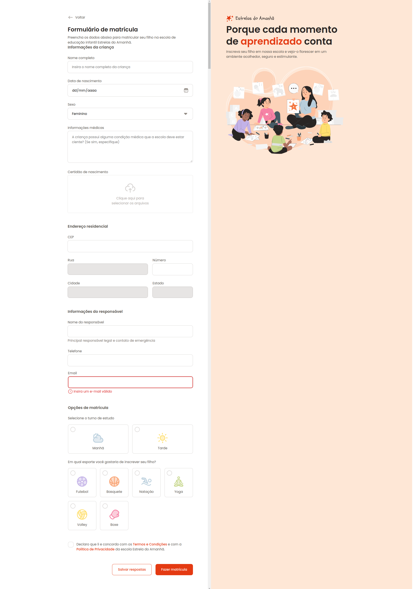

# MBA Rocketseat Full Stack

Projeto de um formulário de matrícula de alunos desenvolvido durante as aulas sobre Formulários da Rocketseat.

  <a href="#-tecnologias">Tecnologias</a>&nbsp;&nbsp;&nbsp;|&nbsp;&nbsp;&nbsp;
  <a href="#-projeto">Projeto</a>&nbsp;&nbsp;&nbsp;|&nbsp;&nbsp;&nbsp;
  <a href="#memo-licença">Licença</a>

  

 

## 🚀 Tecnologias

Esse projeto foi desenvolvido com as seguintes tecnologias:

- HTML
- CSS

## Projeto

Nesse projeto foi desenvolvida uma página de matrícula de alunos.

  

